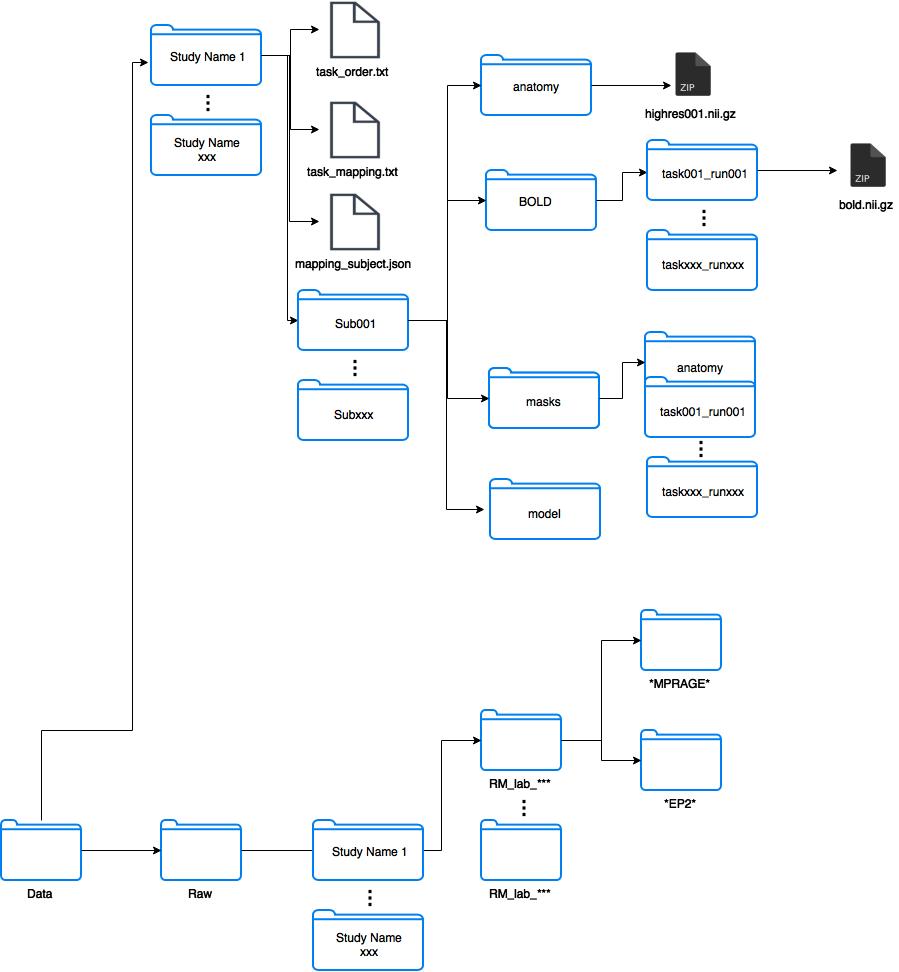

# MVPA Analysis
##Table of Contents

**[Installation Guide](#installation-guide)**

  1. [Nipype Installation](#nipype-installation)
  2. [Download MVPA Analysis](#download-mvpa-analysis)

**[OpenFMRI Structure](#openfmri-structure)**

* [Before Creation](#before-creation)
* [After Creation](#after-creation)
* [MetaData](#metadata)

    * [task_order.txt](#task-order-file)
    * [task_mapping.txt](#task-mapping-file)
    * [mapping_subject.json](#mapping-subject-file)
    * [behavdata.txt](#behavioural-data)

**[Code Design](#code-design)**

* [SubjectDir](#subjectdir)
* [OpenFMRIData](#openfmridata)
* [OpenFMRIAnalyzer](#openfmrianalyzer)

## Installation Guide

1. Nipype installation: Follow nipype [installation guide](http://miykael.github.io/nipype-beginner-s-guide/installation.html) or [this one](http://nipy.org/nipype/users/install.html).

2. Download MVPA Analysis
Open the terminal and run

        git clone https://github.com/labmukamel/mvpa_analysis.git

Notes:

- You might run into problems with running FSL in pycharm. Add the following to pycharm.sh (In: [pycharm installation]/bin/pycharm.sh):

        ./etc/fsl/5.0/fsl.sh

## OpenFMRI Structure


### Before Creation

### After Creation

### Metadata

#### Task Order File (task_order.txt)

The task order file can be general for all subjects and for a specific subject.
In order to use it for specific subjects we can add a file task_order_sub***.txt in the save directory as the task_order.txt

    task001_run001
    task001_run002
    task001_run003
    task002_run001
#### Task Mapping File (task_mapping.txt)
    MVPA_run1	task001_run001
    MVPA_run2	task001_run001
    MVPA_run3	task001_run001
    MVPA_run4	task001_run001
    MVPA_run5	task002_run001
#### Mapping Subject File (mapping_subject.json)
    {"AzOr": 1}
#### Behavioural data (behavdata.txt)

    Onset	Rsponse	StimVar	Stimulus	ResponseTime
    0	 1	 2	 incongruent	 1095	 
    10	 1	 2	 incongruent	 988	 
    20	 1	 1	 congruent	 591	 
    30	 1	 1	 congruent	 499	 
    40	 1	 2	 incongruent	 719	 
    52	 1	 1	 congruent	 544	 
    64	 1	 1	 congruent	 436	 
    76	 1	 2	 incongruent	 470	 
## Code Design
### SubjectDir
 
###### In charge of creating the openfmri structure and converting DICOM files to NIFTY
 
 ```python
def SubjectDir(subject_code, path, raw_path, task_order, task_mapping)"
 ```
 
Parameters

- subject_code: The subject code
- path: Output path in openfmri format
- raw_path: Contains the dicom folders
- task_order.txt: List from to task_order.txt
- task_mapping: List from task_mapping.txt

When we initiate the class, it prepares the subject subdirectories as followed:

- Creates BOLD, anatomy, model, masks folders
- Creates BOLD/taskxxx_runxxx
- Creates modelxxx/onsets/taskxxx
- Creates Mask/anatomytaskxxx_runxxx
- Creates behav/taskxxx_runxxx

And converts the DICOM files to NIFTY

If the path exists(we already created the openfmri structure) then we read it and don't overwrite

### OpenFMRIData

###### Holds SubjectDir and loads the subject mapping, task order and task mapping files to the memory
 
```python 
def OpenFMRIData(data_dir, raw_data_dir, study_name):
```

Parameters

- data_dir: Target openfmri directory
- raw_data_dir: Root raw directory (Only the path to the raw directory (in raw/study_name/subxxx))
- study_name: The name of the study folder containing relevant subjects

```python
def create_subject_dir(subject_name, overwrite = False, create_behav_dict = None):
```

Creates the openfmri structure by creating SubjectDir

Parameters

- subject_name = (string)
- overwrite = States whether we overwrite existing directory
- create_behav_dict = dictionary[2] {'func': function that creates the conditions of the models, 'behav': behavioural path}

Returns:

- SubjectDir Object

```python
def load_subject_dir(**kwargs):
```

Creates or uses the openfmri structure by creating SubjectDir

- Creates the new directories only when given subname!
- Uses current structure when given subcode/subname and the subject_mapping file exists in the study dir
    
Parameters

- subcode = (number) or subname = (string)
- create_behav_dict = dictionary[2] {'func': function that creates the conditions of the models, 'behav': behavioural path}
    - The function will receive: subjectdir, onset_dirs,behavioural_path
    
Returns:

- SubjectDir Object

### OpenFMRIAnalyzer

###### Handles all the FMRI analysis

```python
def OpenFMRIAnalyzer(fmri_data, subjects):
```

Parameters

- fmri_data: OpenFMRIData object
- subjects: Can either be a list of names or a list of SubjectDir


###### Brain Extraction

```python
def extract_brain(self, subject, overwrite = False, f=0.5, g=-0.1):
```

Outputs:

 - mask/anatomy/brain.nii.gz = masked image from fsl view
 - highres001_brain.nii.gz = The extracted brain image 

Parameters

 - subject = Subject Dir object
 - overwrite = States whether or not to overwrite the image
 - f = fractional intensity threshold
 - g = vertical gradient in fractional intensity threshold (-1, 1)

Returns

 - Path to anatomy/highres001_brain.nii.gz

###### Bias field estimation

```python
def estimate_bias_field(self, subject, brain_image, overwrite=False)
```

 - Before running FAST an image of a head should first be brain-extracted, using BET. The resulting brain-only image can then be fed into FAST.

Outputs:

 - highres001_bias.nii.gz = output estimated bias field
 - highres001_restore.nii.gz = output restored image (bias-corrected image)

Parameters

 - subject = Subject Dir object
 - brain_image = Path to the image after it was extracted by BET
 - overwrite = False

Returns:

 - Path to 'highres001.nii.gz' file
 
 ###### Motion Correction

```python
def motion_correction(subject, merge_task_runs=False)
```

Uses MCFLIRT to run motion correction on the bold image

Outputs:

 - bold_mcf.nii.gz = The image after motion correction for each functional folder

Parameters

 - subject = Subject Dir object
 - merge_task_runs = if true - Merges the files before motion correction and after it's done we split them back
 
###### Anatomical Registration

```python
def anatomical_registration(subject):
```

1) Runs FLIRT on the brain extracted anatomy image with MNI152_T1_2mm_brain.nii.gz as reference
2) Runs FNIRT on the anatomy image

Outputs:

 - anatomy/reg/highres2standard.nii.gz
 - anatomy/reg/highres2standard.mat
 
 - anatomy/reg/highres2highres_jac
 - anatomy/reg/highres2standard_warp.nii.gz

Parameters

 - subject = Subject Dir object

###### Functional Segmentation

```python
def functional_segmentation(subject):
```

Outputs:

 - masks/*run_name*/grey.nii.gz

Parameters

 - subject = Subject Dir object
 
###### Anatomical Segmentation

```python
def segmentation(subject):
```

Outputs:

 - masks/anatomy/grey.nii.gz

Parameters

 - subject = Subject Dir object